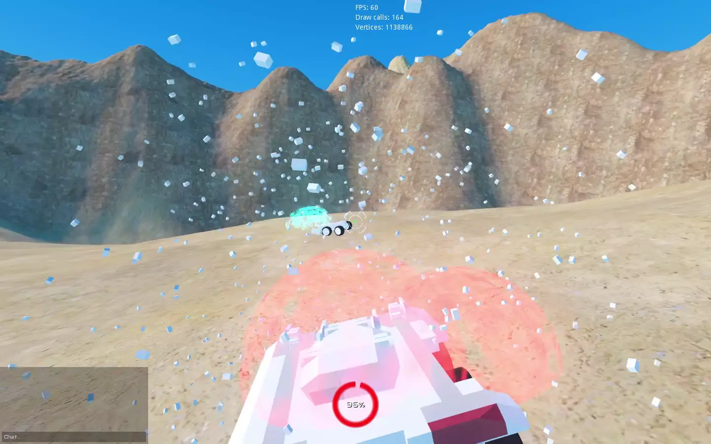

# Own War



This repository is fork of [OwnWar](https://github.com/Demindiro/OwnWar), and using Docker to handle the dependency chain, so that someone who want modified this game can more easily setup development environment.

Check [README](./OwnWar/README.md) for more information about the game.

## Development

```shell
bash scripts/setup.bash
```

After setup, you woud get modified Godot at `build/Godot_v3.3.5-modified_x11.64`, open the game project in the `OwnWar/gd/project.godot` with modified Godot and you can edit the game.

Note, some of game code is written in Rust placed at `OwnWar/gdn/ownwar/`, rebuild is required if you change the Rust code.